# Outgoing Message States

Every outgoing message is in exactly one `MessageStatus`. Terminal success is
**sticky** — a late NAK arriving on a second path can never downgrade recorded
proof of delivery. Retries mint a fresh packet id (the mesh dedupes recent
ids) and migrate reactions/replies to the new message.

```mermaid
stateDiagram-v2
    state "waitingForPeer (7)\n“Waiting for their radio”" as held
    state "waitingForRadio (1)\n“Waiting for radio” (outbox)" as outbox
    state "sending (2)\n“Sending…”" as sending
    state "relayed (3)\n“Relayed by the mesh…”" as relayed
    state "deliveredToRadio (4)\n“Delivered to their radio ✓”" as delivered
    state "sentToMesh (5)\n“Sent to mesh ✓”" as sent
    state "failed (6)\n“Couldn't deliver”" as failed

    [*] --> sending : tap Send while connected
    [*] --> outbox : composed while disconnected
    [*] --> held : long-press → Send When Their Radio Is Heard

    held --> sending : peer's radio heard (any packet) — timeout clock restarts
    held --> sending : Send Now (connected)
    held --> outbox : Send Now while disconnected

    outbox --> sending : radio connects (outbox flush / 60s mailbox sweep,\nincl. messages iCloud-synced from another device)

    sending --> sent : routing OK — channel broadcast (implicit ack). TERMINAL
    sending --> delivered : routing OK — explicit ack FROM the recipient\n(addressed to us, not our own radio's echo). TERMINAL
    sending --> relayed : routing OK — implicit ack (mesh forwarded it,\nrecipient not yet confirmed)
    sending --> failed : routing error (NAK, decoded reason)\nor 5-min stale sweep (own transmissions;\n1h stray net for CloudKit bystanders) — ackError −1

    relayed --> delivered : explicit recipient ack arrives later
    relayed --> failed : late NAK (relayed is not terminal)

    failed --> sending : Retry Now (fresh packet id)
    failed --> outbox : Retry Now while disconnected
    failed --> held : Send When Their Radio Is Heard

    delivered --> [*]
    sent --> [*]
```

## What each state proves (Delivery Details wording)

| State | Meaning | Proves |
|---|---|---|
| `waitingForPeer` | Held until the recipient's radio is heard again | Nothing sent yet |
| `waitingForRadio` | In the outbox; transmits at next connection | Nothing sent yet |
| `sending` | Written to our radio, awaiting a routing result | Radio accepted the frame |
| `relayed` | Some node rebroadcast it | It left our radio; recipient unknown |
| `deliveredToRadio` | The **recipient's radio** acked (DM only) | Their radio has it — not that they read it |
| `sentToMesh` | Broadcast accepted (channels only) | It went out once; receipt is unknowable |
| `failed` | NAK (with decoded reason) or local timeout | Delivery not confirmed — may still have arrived |

Notes:
- `received (0)` is the inbound state — out of scope here.
- Dedupe across devices keeps the **best** status by proof rank:
  delivered > sent > relayed > sending > waitingForRadio > waitingForPeer > failed.
- Live Activities mirror these exact store verdicts (never stronger claims).
